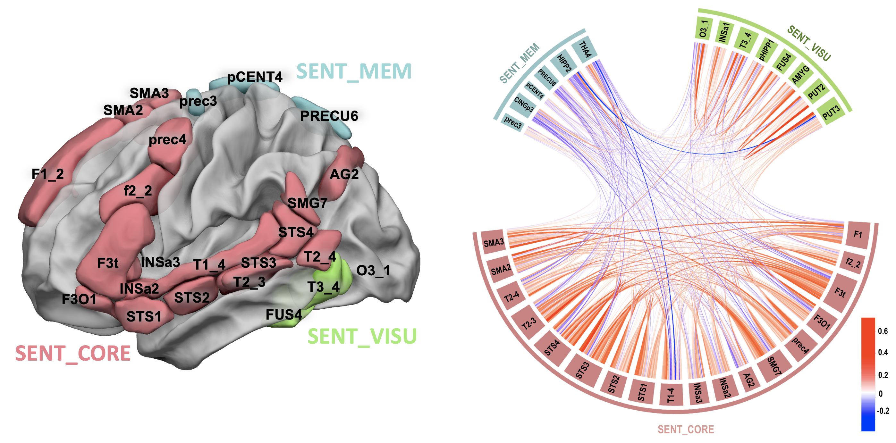
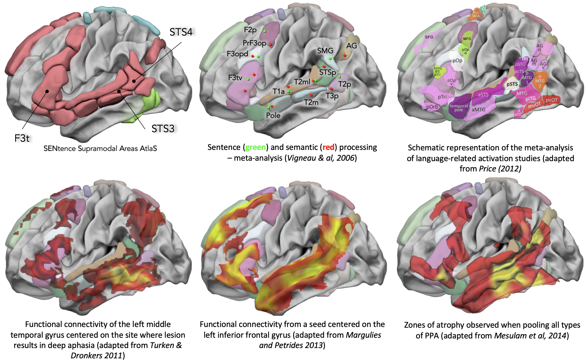

Sentence Supramodal Areas Atlas (SENSAAS)
================

## Reference

**Labache**, L., Joliot, M., Saracco, J., Jobard, G., Hesling, I., Zago,
L., … & Tzourio-Mazoyer, N. (2019). A SENtence Supramodal Areas AtlaS
(SENSAAS) based on multiple task-induced activation mapping and graph
analysis of intrinsic connectivity in 144 healthy right-handers. Brain
Structure and Function, 224(2), 859-882. DOI:
[10.1007/s00429-018-1810-2](https://doi.org/10.1007/s00429-018-1810-2)

------------------------------------------------------------------------

## Background

32 multimodal areas of sentence processing activated and leftward
asymmetrical during sentence production, reading and listening were
identified by comparison with a reference task (word list production,
reading and listening). The temporal correlations at rest between these
32 regions made it possible to detect their belonging to 3 networks.
**Among these networks, one, including 18 regions, contains the
essential language areas (*SENT_CORE* network)**, *i.e.* those whose
lesion would cause an alteration in the understanding of speech.

------------------------------------------------------------------------

## Data release

The `data` folder contains 3 files:

-   `read_me_SENSAAS.rtf`: README file containing information about the
    atlas
-   `SENSAAS.nii`: NIfTI file containing the 32 brain language regions
    in the MNI space

-   `SENSAAS.csv`: a CSV file containing a full description of each
    language areas. The first column (*Index*) correspond to the index
    of each region that is used in the NIfTI file. The second column
    (*ROI*) is the anatomical labels of each regions. The column
    *Network* corresponded to which of the 3 networks a region belongs.
    Finaly, the MNI coordinate (columns *Xmm*, *Ymm*, *Zmm*) of each
    regions centroid is provided.

The 3 networks as are briefly described below. For researchers
interested in language, they should focus on the 18 brain regions
belonging to the network named **SENT_CORE**. - **SENT_CORE** included
18 essential sentence processing regions. - **SENT_VISU** aggregated
areas acknowledged as involved in visual processing. - **SENT_MEM**
aggregated areas belonging to both the posterior regions of the DMN
involved in episodic memory.

**SENT_CORE** have been further compared to the literature and overlap
with

**SENT_CORE** included areas of the antero-posterior language networks,
named in reference to the Broca–Wernicke model in aphasia literature and
reported with consistency in meta-analyses of healthy individuals mapped
during language tasks and resting-state. The anterior pole corresponded
to the regions named *F3t*, equivalent to Broca area. The posterior pole
corresponded to Wernicke area (*STS3* & *STS4*).

------------------------------------------------------------------------

## Other atlases that might interest you

-   Word-List Multimodal Cortical Atlas:
    [WMCA](https://github.com/loiclabache/WMCA_brainAtlas)
-   HAnd MOtor Area atlas:
    [HAMOTA](https://github.com/loiclabache/HAMOTA_brainAtlas)
-   Atlas of Lateralized visuospatial Attentional Networks:
    [ALANs](https://github.com/loiclabache/ALANs_brainAtlas)
-   Atlas of Intrinsic Connectivity of Homotopic Areas:
    [AICHA](https://www.gin.cnrs.fr/en/tools/aicha/)

------------------------------------------------------------------------

## Questions

Please contact me (Loïc Labache) as <loic.labache@yale.edu> and/or
<loic.labache@ensc.fr>
